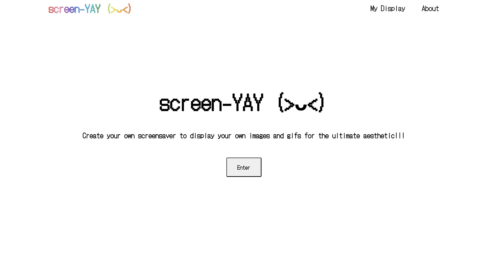
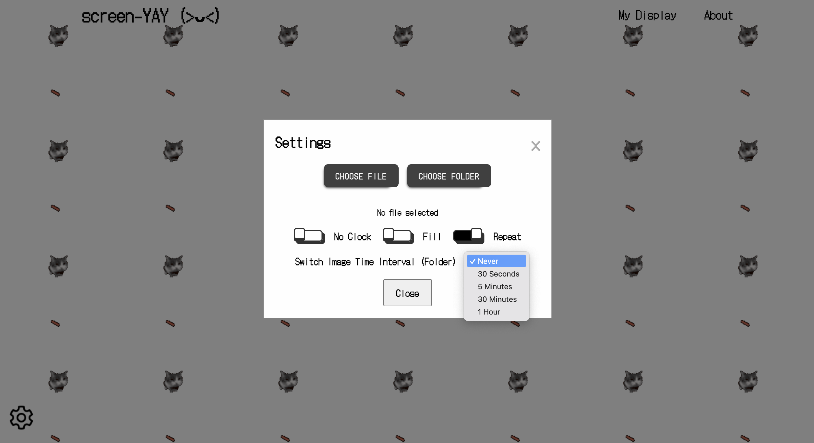
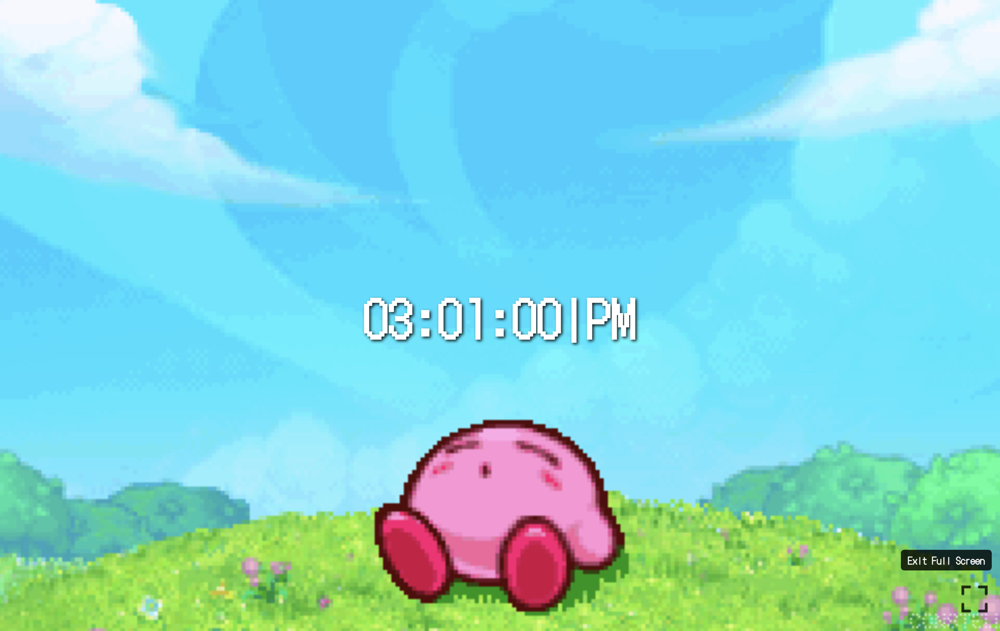
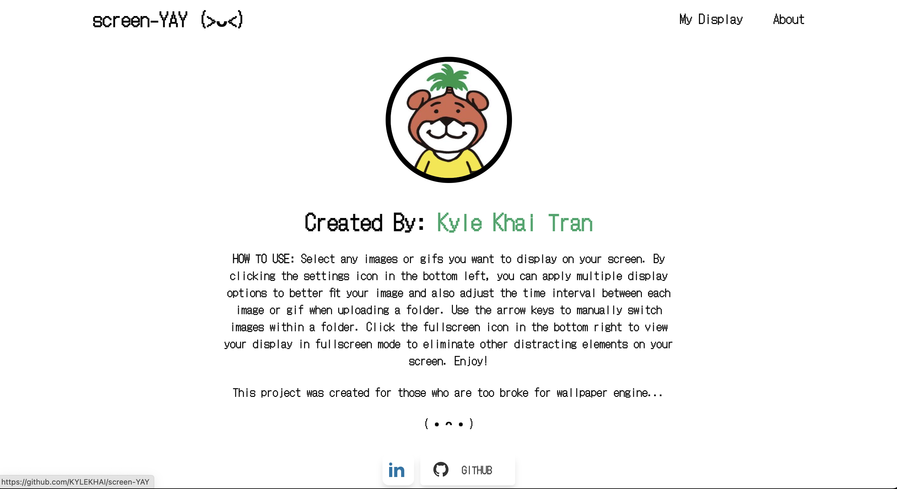

# screen-YAY

**screen-YAY** is a customizable screensaver application that allows users to display their own images and GIFs for a personalized aesthetic experience. Whether for deep studying sessions or to just show off desk setups, screen-YAY can do it!

## Features

1. **Select Images or GIFs**: Click the settings icon in the bottom left and choose files or a folder of images/GIFs.
2. **Apply Options**: Use the settings modal to adjust display options such as image fill, repeat, and adjust the time interval for automatic file switches.
3. **Navigate Images**: Use the left and right arrow keys to manually switch images within a folder.
4. **Fullscreen Mode**: Click the fullscreen icon in the bottom right to enter fullscreen mode to fully enter zen mode.
5. **Realtime Clock**: Switch the toggle to display the local time in your system.

## Technologies/Resources Used

- **HTML/CSS**
- **JavaScript**
- **Fullscreen API**
- **File API**
- **https://icons8.com/**
- **https://uiverse.io/**
- **https://codepen.io/**
- **https://fonts.google.com/**

## Screenshots

<table>
 <tr>
    <td></td>
    <td></td>
    </tr>
    <tr>
      <td></td>
      <td></td>
    </tr>
 <tr>
</table>

## License

This project is licensed under the MIT License.
